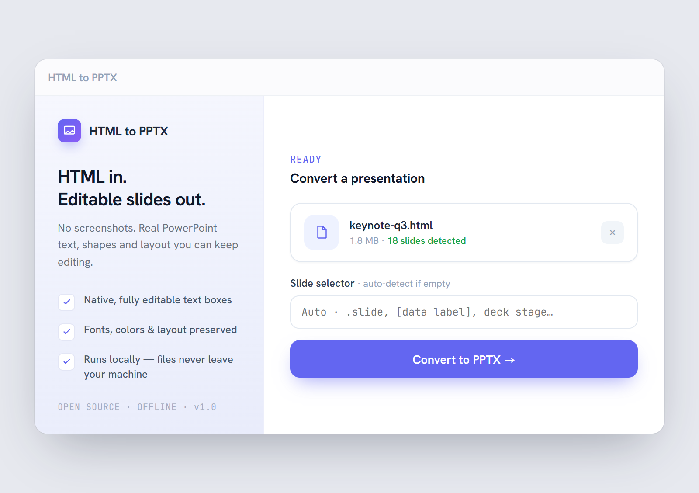
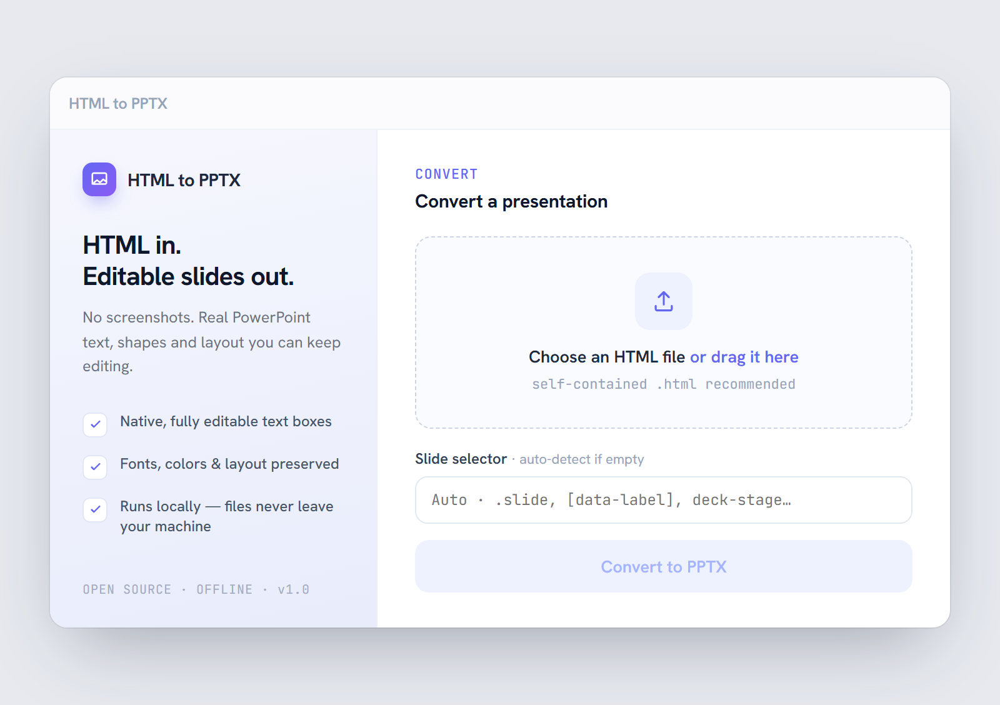
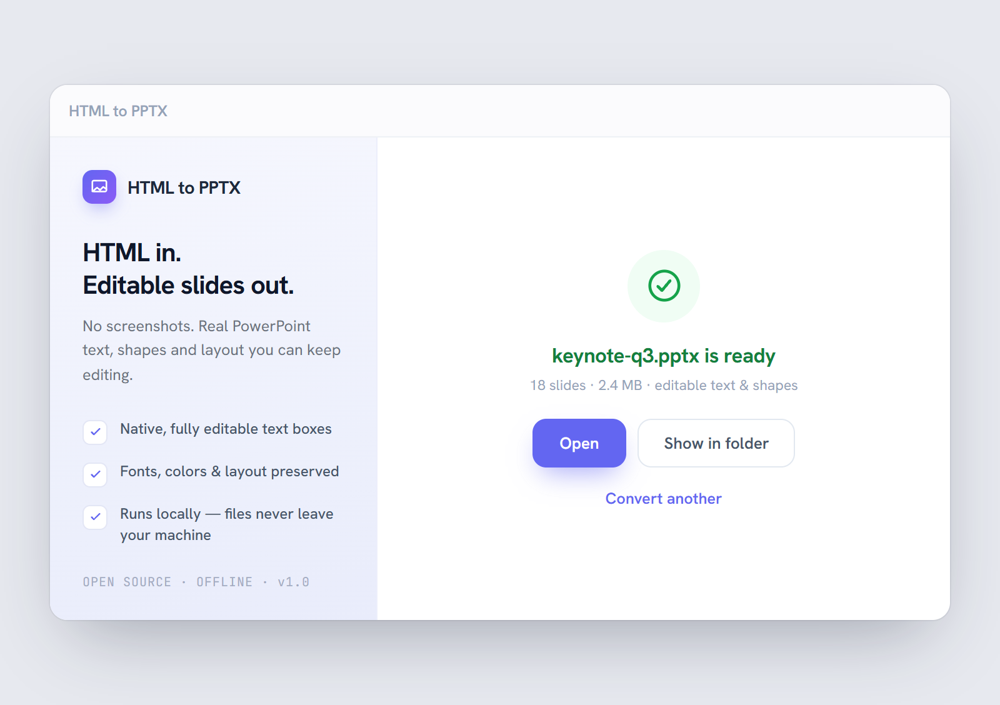

<div align="center">


# HTML to PPTX

**Turn a finished HTML deck into a native, fully‑editable PowerPoint (`.pptx`).**
Real text boxes and shapes you can keep editing — *not* flat screenshots.

[](https://github.com/mmoollee101-lab/HTMLtoPPTX/actions/workflows/ci.yml)
[](LICENSE)




</div>

---

## Why

You have a polished HTML presentation and you want it as a PowerPoint that recipients
can **reuse like a template** — clicking a title to retype it, recoloring a shape,
nudging a box. A screenshot‑to‑PPT export gives you flat images you can't edit.

**HTML to PPTX** renders your deck in real headless Chromium, measures every element,
and rebuilds each slide as **native PowerPoint text boxes, shapes and vector SVG** —
with fonts embedded and on‑screen line breaks preserved.

> Editable conversion is, by design, **not pixel‑perfect** (PowerPoint re‑flows text).
> It's tuned for the template use case, where small shifts are fine. If you need a
> pixel‑exact, non‑editable copy, export a PDF instead (out of scope here).

## Features

- 🧩 **Native, editable output** — text boxes, shapes and vector charts, not images.
- 🔤 **Automatic font embedding** — web fonts (Pretendard, Google Fonts…) are fetched
  Node‑side and embedded, including the real **bold** face, so layout doesn't drift.
- ↩️ **Line‑break locking** — the exact on‑screen wrap points are baked in so PowerPoint
  shows the same breaks (no mid‑word splits when a fallback font is wider).
- 📐 **Any aspect ratio** — the source slide ratio is auto‑detected (16:9, 4:3, portrait,
  ultrawide); no forced cropping.
- 🎞️ **Slideshow decks handled** — web‑component / reveal.js style decks (`<deck-stage>`)
  that show one slide at a time are auto‑switched to their print layout so every slide
  exports (no blank white slides).
- 🌏 **CJK‑ready** — Korean/Japanese/Chinese decks keep their fonts (incl. bold) and exact
  line breaks; Unicode filenames are preserved on save.
- 🔒 **100% local & offline** — your files never leave your machine. Fonts are self‑hosted.
- 🖥️ **Three ways to run** — a CLI, a local web app, and a portable desktop app.

## Screens

| Choose a file | Ready to convert | Done |
|---|---|---|
|  |  |  |

## Quick start

Requires **Node.js ≥ 18**. The first install downloads a bundled Chromium via Puppeteer.

```bash
git clone https://github.com/mmoollee101-lab/HTMLtoPPTX.git
cd HTMLtoPPTX
npm install
npm run sample        # converts samples/sample.html → samples/sample.pptx
```

### Desktop app (portable, no install)

Grab **`HTML-to-PPTX-<version>-portable.exe`** from the
[Releases](https://github.com/mmoollee101-lab/HTMLtoPPTX/releases) page and double‑click it.
No Node, no browser, no setup — Chromium is bundled. On first launch it self‑extracts to a temp
folder (a few seconds), then opens a single frameless window with standard minimize / close
controls. Converted files land in your **Downloads** folder.

> The binary is **unsigned**, so Windows SmartScreen / antivirus may warn on first run
> ("Windows protected your PC" → *More info* → *Run anyway*). Code signing is on the roadmap.

**Build it yourself** (from a clone):

```bash
npm run app           # dev: run the Electron app from source
npm run dist          # build dist/HTML-to-PPTX-<version>-portable.exe (Windows)
```

`npm run dist` stages the bundled Chromium (`predist`) and packages a portable `.exe` via
electron‑builder. (The older Puppeteer `--app` launcher is still available as `npm run app:server`.)

### Web app (any browser)

```bash
npm run web           # then open http://localhost:3000
```

Drag in a `.html` file (or pick one), optionally set a slide selector, and convert.
The `.pptx` is written to your **Downloads** folder; **Open** / **Show in folder**
launch it through the OS.

> The web/app modes can't resolve **relative** asset paths in uploaded HTML — use
> **self‑contained** HTML (absolute URLs or `data:` URIs) for images and fonts.
> Decks with many local relative assets are best converted with the CLI.

### CLI

```bash
# single file (output name is inferred: deck.html → deck.pptx)
node src/cli.js deck.html

# explicit output, custom slide selector
node src/cli.js deck.html slides.pptx -s "section.slide"

# batch: convert every .html in a folder
node src/cli.js ./decks ./out -s ".page"

node src/cli.js --help
```

| Option | Description | Default |
|---|---|---|
| `<input>` | input `.html` file **or** a folder (batch) | required |
| `[output]` / `-o, --out` | output `.pptx` (single) or output folder (batch) | inferred |
| `-s, --selector` | CSS selector for one slide | auto / `.slide` |
| `--aspect <w:h>` | force slide aspect ratio | auto‑detect |
| `--no-lock-breaks` | let PowerPoint re‑flow text instead of freezing breaks | off |
| `--no-embed-fonts` | don't embed web fonts (smaller file, may shift) | off |
| `--print` / `--no-print` | force / disable the slideshow print layout | auto |

If the selector matches nothing, the tool prints the candidate ids/classes it found.

## How it works

1. **Render** — Puppeteer (headless Chromium) loads the HTML and waits for web fonts,
   so `dom-to-pptx` measures real glyph metrics.
2. **Resolve & fix** — embeddable font URLs are fetched Node‑side; inline‑margin gaps and
   decorative pseudo‑element markers are normalized; soft line breaks are baked to `<br>`.
3. **Convert** — `dom-to-pptx` exports the slide elements to absolutely‑positioned PPTX
   boxes, keeping SVG as vectors. Post‑processing fixes line spacing and adds the bold face.

```
src/convert.js     conversion engine (Puppeteer + dom-to-pptx) — shared by CLI/web/app
src/cli.js         CLI (arg parsing, batch, errors)
src/server.js      local web server (Node http only) — detect/convert/open/reveal endpoints
src/util.js        shared helpers (output dir, filename dedup, path guard)
electron/          Electron shell — main.js (window + IPC) + preload.js (window.api bridge)
scripts/           build helpers (resolve-chromium.js stages the bundled browser)
public/            desktop UI (self-hosted fonts + icons) — IPC in Electron, fetch on the web
samples/           sample deck
docs/              design + PDCA notes
```

## Fidelity tips

- **Author at a fixed pixel size** (e.g. `1920×1080` or `1024×768`). `vw/vh/%` units are
  measured against the 1920×1080 viewport and can throw off the detected ratio.
- **Korean / CJK:** use `word-break: keep-all` and leave a little slack in text boxes so
  replacement copy doesn't overflow.
- **Fonts:** `woff`, `woff2`, `ttf` and `otf` web fonts are all embedded automatically —
  including fonts inlined as `data:` URIs (self-contained decks) and cross-origin CDN fonts.
  woff2 is decoded to TrueType so PowerPoint (which can't read woff2) embeds the real face,
  and a matching bold weight is added so bold text isn't rendered as a mismatched faux-bold.

## Roadmap

- [x] Package as a **portable desktop app** (Electron) with a frameless window, native file
      dialogs and a bundled Chromium — no Node install required. (`npm run dist`)
- [ ] Code signing (remove the SmartScreen/AV warning).
- [ ] Per‑slide real conversion progress.
- [ ] Prebuilt releases for macOS / Linux (Windows portable ships today).

## FAQ

**Is the output pixel‑perfect?**
No — by design. PowerPoint re‑flows text, so expect minor shifts. The goal is an *editable*
deck you can reuse as a template. For a pixel‑exact, non‑editable copy, export a PDF instead.

**Does it really work offline?**
Yes. Everything runs on your machine, the UI fonts are self‑hosted, and the portable desktop
app bundles its own Chromium. Nothing is uploaded.

**Why is my `.pptx` large?**
Embedded fonts and vector graphics add weight. Pass `--no-embed-fonts` to shrink it (the
layout may shift to a fallback font).

**My slides came out blank / white.**
Your deck probably shows one slide at a time (a slideshow web component like `<deck-stage>`
or reveal.js). These are auto‑detected and exported via their print layout — if yours isn't,
force it with `--print` or pass the right `--selector`.

**Does it support Korean / Japanese / Chinese?**
Yes — CJK fonts (including bold) are embedded and line breaks are locked. Use
`word-break: keep-all` and leave a little slack in text boxes. Unicode filenames are kept.

**Windows warns the portable `.exe` is unsafe.**
The binary is unsigned, so SmartScreen shows a warning. Verify you got it from the official
[Releases](https://github.com/mmoollee101-lab/HTMLtoPPTX/releases) page, then *More info → Run
anyway*. Code signing is on the roadmap.

## Contributing

Issues and PRs welcome — see [CONTRIBUTING.md](CONTRIBUTING.md). Please also read the
[Code of Conduct](CODE_OF_CONDUCT.md). The UI is built from the spec in
[`design_handoff_html_to_pptx/`](design_handoff_html_to_pptx/); security reports go through
[SECURITY.md](SECURITY.md).

## Acknowledgements

Built on [`dom-to-pptx`](https://www.npmjs.com/package/dom-to-pptx) and
[Puppeteer](https://pptr.dev/). UI typefaces are
[Hanken Grotesk](https://fonts.google.com/specimen/Hanken+Grotesk) and
[JetBrains Mono](https://www.jetbrains.com/lp/mono/), both under the SIL Open Font License.

## License

[MIT](LICENSE) © contributors.
Bundled fonts (Hanken Grotesk, JetBrains Mono) are licensed under the
[SIL Open Font License 1.1](https://openfontlicense.org/).
